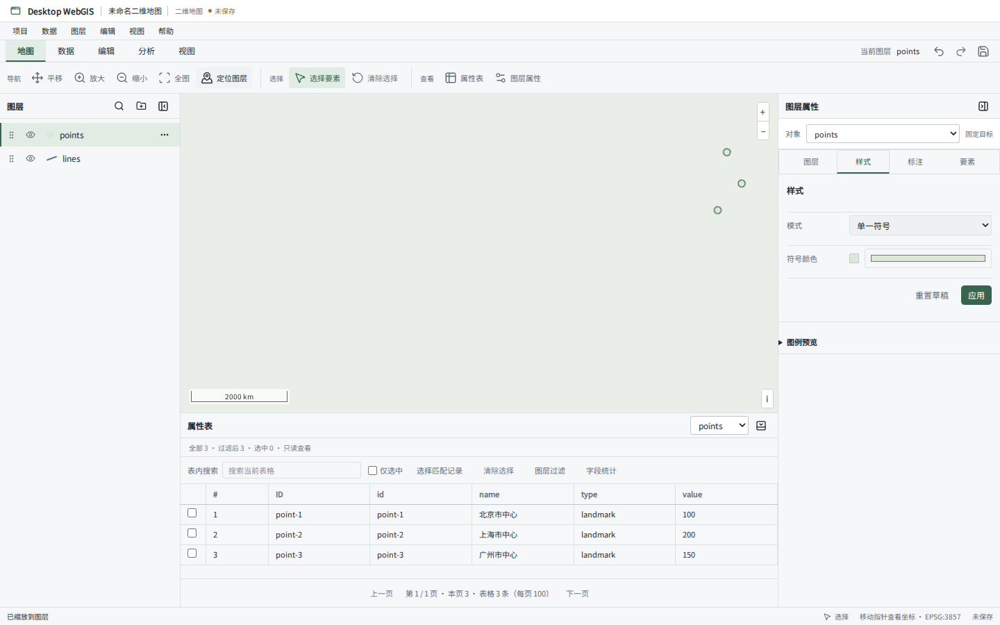
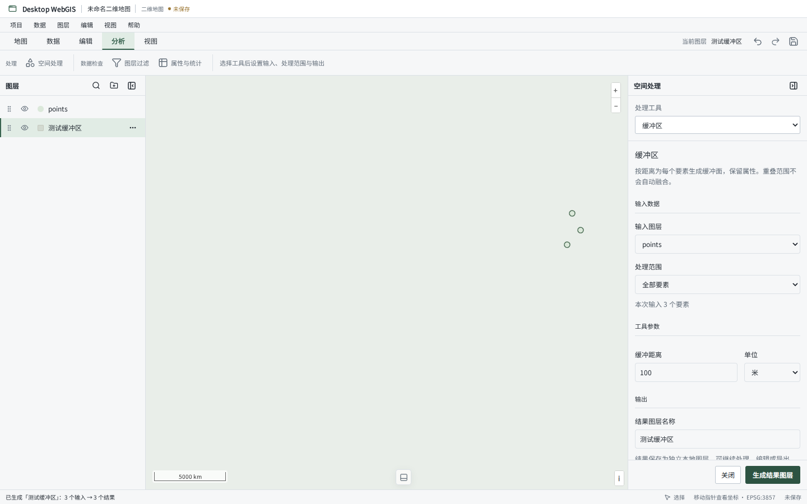
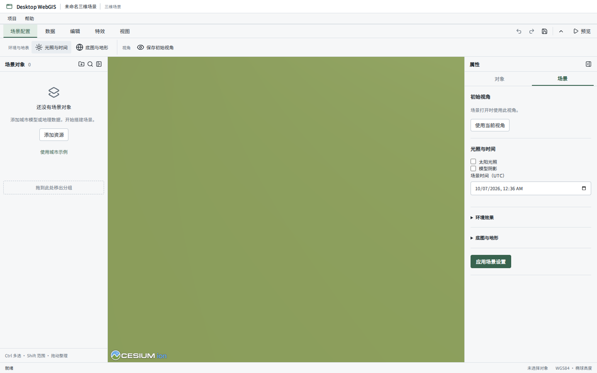

# 工作台产品化重构

## 本地集成（2026-10-08）

补丁源提交为 `f92d303`，基线为 `c32d9c2`。本地合并在 `a31e7c5` 之后，保留三维变换手柄跟随、渲染质量设置、紧凑属性表单、信息提示和实时属性更新。

二维采用补丁的新任务功能区、独立属性表与检查器目标、样式草稿切换确认和停靠空间处理。编辑目标统一存入 `workbench.store`，删除图层和切换项目时清理；不保留两套编辑目标状态。三维继续使用现有共用 Ribbon 和单行属性标题，不恢复“应用变换”或“应用场景设置”按钮。

下方截图来自补丁包的源版本；本地集成的界面与验证以浏览器验收产物和本节记录为准。

本地验证：Desktop TypeScript/Vite 构建、149 项桌面测试、18 项地图运行时测试通过；5 项需要原生环境的测试跳过。本机 Chrome 完成 15 项浏览器交互用例，覆盖三种窗口尺寸。三维用例额外确认光照即时生效及撤销、无“应用场景设置”按钮、非法雾浓度不写入历史。原生文件对话框、系统密钥链和远程三维服务未在本次重新验收。

Windows 如缺少 Playwright 浏览器，可以设置 `PLAYWRIGHT_CHROMIUM_EXECUTABLE` 为本机 Chrome 的完整路径，再运行 `test:e2e`。

本次以 `c32d9c2` 为代码基线，沿用已确认的 QGIS 式任务组织规则。二维和三维保留各自运行时与业务能力，共享项目身份、紧凑功能区、停靠面板、对象上下文、状态与表单密度。

## 用户路径

| 场景 | 入口与行为 |
| --- | --- |
| 开始工作 | 起始页直接创建二维地图或三维场景；项目菜单仍提供命名新建、打开与保存 |
| 组织数据 | 添加数据窗口区分本地文件与地图服务，显示读取、配置、确认步骤；图层树支持分组、排序、显隐与更多菜单 |
| 配置图层 | 从图层上下文菜单或数据功能区打开属性、样式、标注；右侧面板绑定对象并支持显式切换；未应用草稿切换时选择应用、丢弃或取消 |
| 编辑要素 | 显式开始编辑后锁定目标；浏览其他图层不改变编辑对象；完成操作进入原有历史，结束编辑不创建新的事务或回滚已完成操作 |
| 查看属性 | 底部表格绑定用户打开的图层，独立选择器切换；搜索仅影响表格，过滤条件编辑后显式应用，统计按需展开 |
| 空间处理 | 分析功能区打开右侧工具参数；选择真实工具，设置输入与范围、参数、输出；运行反馈和结果查看保持在该流程中 |
| 三维配置 | 对象树与场景功能区保留；场景设置的环境和地表参数折叠，样式、对象编辑、预览与发布保持原有实现 |

首次打开右侧和底部关闭，后续恢复用户的持久化布局。停靠面板占据布局空间，地图控件跟随地图实际可用区域。

## 状态边界

`workbench.store` 保存临时任务目标（编辑、配置、属性表）、当前工具、待处理的草稿切换与地图读数。它不保存 GIS 数据、不进入项目文件、不产生 dirty 或撤销历史。

`session.store` 继续保存按图层区分的样式草稿、表格搜索和统计设置。`workspace.store` 只保存停靠布局。项目切换清理临时目标；删除图层清理对应目标，正在编辑的工具回到选择模式。

`OlToolRuntime.cancelSketch()` 只取消尚未完成的绘制。Esc 优先取消草稿，再切回平移；编辑目标保持锁定。已经完成的几何操作仍通过原有撤销历史恢复。

## 验证

- 单元与回归：`pnpm --filter @desktop-webgis/desktop test --maxWorkers=2`
- 地图工具运行时：`pnpm --filter @desktop-webgis/ol-runtime test --maxWorkers=2`
- 桌面构建：先构建工作区依赖，再运行 `pnpm --filter @desktop-webgis/desktop build`
- 浏览器交互：`pnpm --filter @desktop-webgis/desktop test:e2e`；首次运行需 `pnpm --filter @desktop-webgis/desktop exec playwright install chromium`

浏览器用例覆盖 1440×900、1024×680、1920×1080 的默认布局、真实 GeoJSON 导入、表格目标、过滤应用、编辑锁定、样式草稿切换和真实缓冲结果。测试阻断外部 OSM 瓦片请求，地图业务与处理算法均使用真实实现。软件界面不包含测试模拟数据。

原生文件选择、系统密钥链及三维远程服务的完整运行验收需要 Tauri/操作系统环境。本次没有更改这些协议和业务实现。

## 实际界面

浏览器截图来自仓库 GeoJSON 样例的真实导入流程；外部底图瓦片在验收环境中阻断。

