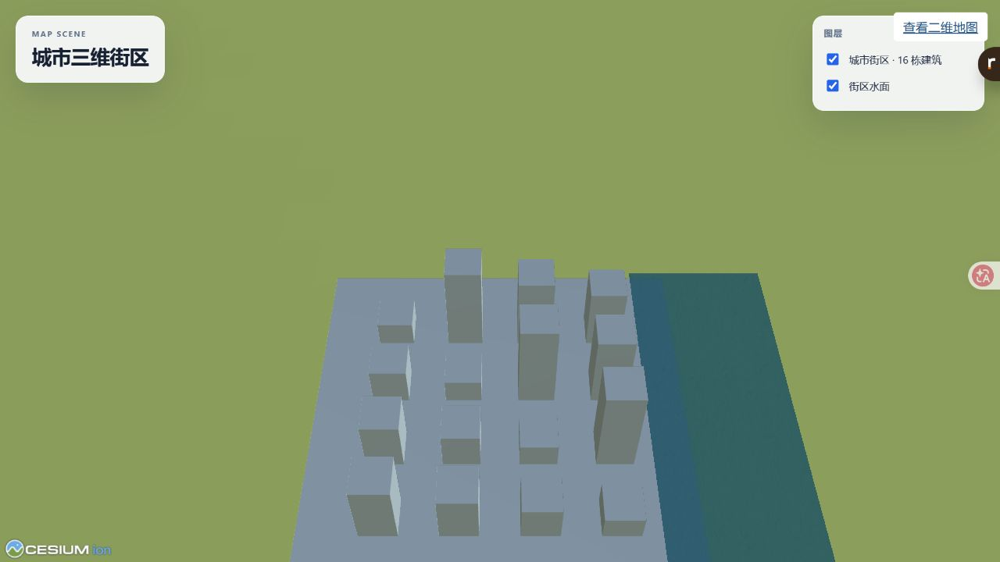

# 城市三维场景与 Cesium 扩展库

工作分支：`codex/feat-city-3d`。基于 main 的隔离工作区开发，不纳入主工作区已有未提交改动。

## 实施范围

- 城市三维入口，影像/地形配置，GLB、3D Tiles、GeoJSON 图层。
- 独立图层、Popup、3D Tiles 变换编辑、水面与基础特效包。
- ENU 平移、旋转、缩放；预览与提交分离，一次拖动一个撤销记录。
- 工程保存恢复、场景配置、独立 Viewer、静态资源发布。
- 无令牌城市样例、消费者示例、构建和测试。

API 借鉴 Mars3D 的 addLayer / bindPopup 风格；不引入 Mars3D 运行时。参考 cesium-demo 的模型编辑交互，重新实现生命周期、取消操作和相机状态恢复。该仓库水面实现依赖私有渲染 API，README 标注反混淆来源；首版水面使用 Cesium 公开 Material API 独立实现。

高级反射水面、网格/单建筑结构编辑、二三维相机实时联动属于后续演进，不伪装为首版已支持。

## 实现与验证（2026-10-02）

独立包：cesium-layer、cesium-popup、cesium-tileset-edit、cesium-effects、cesium-scene-schema、cesium-scene-runtime。均提供 ESM、类型声明、README、MIT LICENSE；Cesium 为 peer dependency，纯 schema 无引擎依赖。包版本 0.1.0，未执行 npm 发布。

Desktop 的「城市三维」入口支持城市样例、在线/相对资源、模型手柄和数值变换、GLB 拖入放置、显隐、重新加载、Popup 字段、水面参数/边界 JSON、雾/辉光、相机、工程持久化和共用撤销。主 SceneManifest.version=2 增加可选 city，旧二维场景继续可读；纯 CityScene.version=1 有独立结构校验与 JSON Schema。

- 全工作区构建通过，含独立消费者、Desktop、Viewer。Cesium 三维模块按需加载；仍有约 4.3 MB 的三维 chunk 体积提示和已有动态/静态导入提示。
- 全工作区测试通过；三维包 28 项、集成协议/历史/发布新增 11 项测试。已有依赖真实服务/系统钥匙串的测试保持跳过，未声称已验证原生钥匙串。
- 实际界面验证城市街区渲染、GLB 加载、东向手柄移动约 75.7 米、一次撤销恢复零位。
- 静态发布命令成功递归打包城市 GLB 和 Cesium 静态资源；发布 Viewer 实际显示模型、水面、图层列表和属性 Popup。
- 六个 tarball 在独立 pnpm 消费者中安装并成功 ESM 导入，不依赖应用源码。重现步骤见 [样例说明](../../examples/city-3d/README.md)。

发布器增加显式 3D Tiles / glTF 依赖收集、路径越界/缺文件/Viewer 覆盖检查；在线资源保持引用。本地隐式瓦片及 i3dm/cmpt/subtree 尚不支持收集；本地影像和地形服务目录不打包。scene-core 增加纯 scene 子入口，使发布 CLI 不再通过编译器入口加载仅适用于 bundler 的 GIS 模块。

