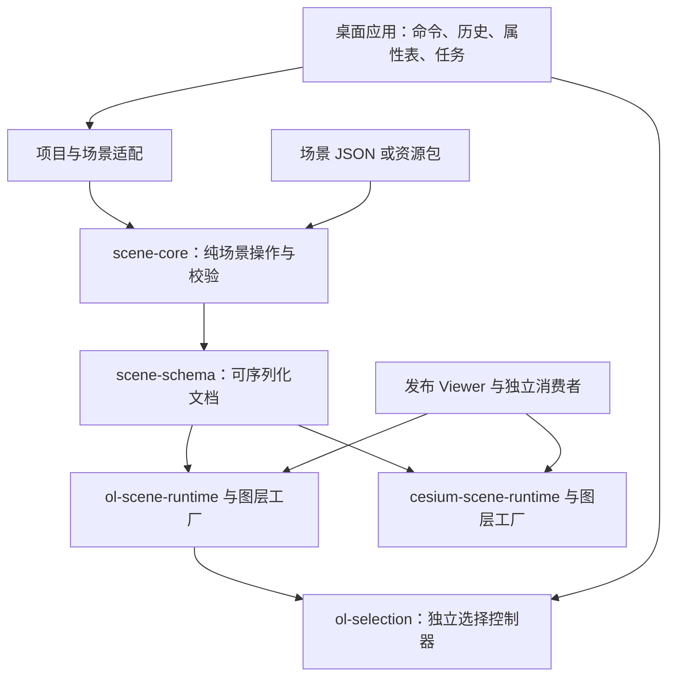

# 选择、图层与统一场景 API 实施计划

> 日期：2026-10-08。源码基线：`6d8b965`，分支 `codex/unified-workbench-desktop`。
> 状态：实施中。选择闭环首批代码为 `163d688`，详见[实施记录](selection-layer-scene-implementation.md)；未完成的阶段与公共发布门槛仍按本文验收。
> 用户目标：二维单击／框选与属性表形成闭环；选择能力具备公共包潜力；图层创建 API 易用；OpenLayers 与 Cesium 内容由可导入、导出的场景对象描述。

## 1. 交付目标与范围

本计划交付三个相互配合的结果：

1. **二维选择闭环**：单击、矩形框选、替换／追加／移除、持续高亮、选中属性表、单条／批量定位，以及可靠的取消和恢复。
2. **公共能力边界**：独立的 OpenLayers 选择包；由配置驱动的图层创建、更新与释放；不依赖桌面组件、Store 或项目编辑命令。
3. **统一场景往返**：用版本化 JSON 描述资源、对象、组织、二维／三维视图和环境。应用、独立消费者、发布 Viewer 使用同一描述和渲染路径，可导入、修改、导出、重新加载。

“统一”表示共用场景文档、身份、资源和生命周期规则，保留不同引擎的表现能力。它不自动把三维模型转换成二维数据，不要求二维和三维对象拥有相同属性，也不改变当前二维／三维独立工作区的产品约定。

首版包括现有图层与对象类型。矢量瓦片、聚合选择、点云、三维建筑单体编辑、多人协作及云资源下载不因本计划自动变成承诺。自定义类型通过有校验和序列化约定的扩展接入。

本文衔接[统一工作台](../specs/06-Unified-Workbench.md)、[全产品整改](../design/product-design-review-2026-10-08.md)和[城市编辑器核心能力计划](city-editor-product-and-core.md)。新增选择操作遵守紧凑布局；不增加教程侧栏或固定介绍段落。已有样式草稿、独立编辑目标、三维实时属性和撤销规则必须保留。

## 2. 当前基础与已确认缺口

以下是源码确认，不是本轮新增功能验收。

| 文件／包 | 当前基础 | 本计划处理的缺口 |
| --- | --- | --- |
| [OlSelectionRuntime](../../packages/ol-runtime/src/selection/OlSelectionRuntime.ts) | OL Select、单击、清除、Store 到高亮同步 | 无 DragBox；依赖 OlMapRuntime、gis-core 选择类型和固定高亮样式；停用交互时高亮消失 |
| [map-runtime-host](../../apps/desktop/src/features/map/map-runtime-host.ts) | 激活工具、绑定当前图层、同步 Store；已有单条定位 | 选择工具与高亮绑定；定位实现散在宿主；缺框选完成来源和独立联动命令 |
| [AttributeTable](../../apps/desktop/src/features/attribute-table/AttributeTable.tsx) | 固定表目标、仅选中、搜索、过滤、分页、勾选和单元格编辑 | 无双击定位；行单击切换选择可能与双击、仅选中视图冲突 |
| [OlMapRuntime](../../packages/ol-runtime/src/map/OlMapRuntime.ts) | 底图、注册、项目图层同步、过滤与范围定位 | 创建路径与场景播放器重复，依赖内部项目类型 |
| [createOlSceneLayer](../../packages/ol-scene-runtime/src/layer.ts) | GeoJSON、XYZ、WMS、WMTS、天地图、Google 图层工厂 | 编辑器尚未完全共用；返回原生对象，更新、异步状态、释放契约尚未统一 |
| [OlLayerRegistry](../../packages/ol-runtime/src/layer/OlLayerRegistry.ts) | layerId／datasetId 映射 | 选择公共包不应要求消费者采用这套注册表 |
| [OlToolRuntime](../../packages/ol-runtime/src/edit/OlToolRuntime.ts) | 绘制、修改、删除、捕捉、取消绘制 | 直接输出 gis-core 命令；后续提取需改为领域变化结果，由宿主接入历史 |
| [scene-schema](../../packages/scene-schema/src/types.ts) | SceneManifest v1 输入、v2 标准形式、sources／layers、可选 city | 二维与三维资源、组织和视图结构不同；协议扩展与完整编辑恢复不足 |
| [scene-core](../../packages/scene-core/src/index.ts) | 创建、增删改、序列化和 compileProjectToScene | 核心入口包含 gis-core 编译依赖；公开核心与应用适配应分开 |
| [cesium-scene-schema](../../packages/cesium-scene-schema/src/index.ts) | CityScene v1／v2、assets、nodes、groups、camera、effects、lighting | 需要接入统一文档，保留版本迁移和现有对象语义 |
| [cesium-layer](../../packages/cesium-layer/src/index.ts)／cesium-scene-runtime | 图层类、集合、拾取、异步加载、变换、图形 | 图层工厂、运行时事件和场景编辑入口需与文档契约对齐 |
| [project-io](../../apps/desktop/src/services/project-io.ts) | ProjectSnapshot 保存读取、凭据值排除 | 现有项目文件仍须兼容；新增场景导入不是替换全部项目数据 |
| [CityWorkspace](../../apps/desktop/src/features/city/CityWorkspace.tsx) | 导出编译后的 SceneManifest；导入读取 city 或独立 CityScene | 导入不恢复完整二维内容；发布编译默认可按过滤生成快照；外部资源仅保留地址 |

当前选择未指定图层时允许命中多个图层，却仍用单个 layerId 返回结果，存在身份表达不一致。首版工作台必须明确选择目标；公共包使用图层＋要素联合身份。

旧[场景规范 V0.1](../specs/05-Scene-Manifest-and-Publishing-V0.1.md)主要描述二维发布。当前代码已经超过它的类型范围。新协议定稿时更新规范及迁移说明，不能把旧草案直接当作当前完整支持矩阵。

## 3. 核心架构与依赖方向

下图表示内容流转与组件组合；具体 import 方向以图后的规则为准。工作台和 Viewer 各自组合一套控制器，不在同一地图上重复安装选择交互。



- 依赖不能从公共包反向指向 Desktop、React、Zustand、Tauri 或应用命令。
- 选择包只依赖 OpenLayers；场景协议／纯操作层不导入 OL 或 Cesium 原生类。
- 两个引擎分别打包和按需加载，纯文档消费者不被迫下载引擎。
- `compileProjectToScene` 与反向项目适配从公开纯核心依赖中隔离。优先采用明确子入口；如果包级依赖仍让消费者安装 gis-core，则移到应用适配模块或单独适配包。
- 现有包可继续作为兼容入口。禁止长期维护两套相同图层创建实现。
- API 命名、包的公共 scope 和最终协议版本在 S00／S04 定稿。本文使用仓库工作名 `ol-selection`、`SceneDocument`，不是 npm 包名可用性承诺。

## 4. 选择公共包与工作台交互

### 4.1 用户规则

| 操作／情况 | 约定 |
| --- | --- |
| 选择工具单击 | 普通单击替换为当前要素；空白单击清除当前目标选择 |
| 选择工具左键拖动 | 超过屏幕像素阈值才框选；与平移、拖拽缩放互斥 |
| 普通框选 | 用命中结果替换选择 |
| Shift＋框选 | 追加；同一要素不重复 |
| Alt＋框选 | 从选择移除；Shift＋Alt 同时按下时明确以移除优先 |
| Esc／目标变化／切换工具 | 取消正在拖动的框；不提交中间结果，不清空原选择 |
| 拖动开始 | 固定目标、选择操作和原集合；本次手势使用这份基线 |
| 框选完成 | 提交一次最终选择，并触发显示选择结果；不自动缩放地图 |
| 返回平移 | 持续显示已确认选择的高亮 |
| 图层隐藏／过滤／刷新／删除 | 不显示已不可见的高亮；失效选择按宿主规则清理并通知表格 |
| 已加载 WFS | 仅选择已加载且可见的要素，不声称查询了整个服务 |

工作台首版仅选择当前矢量图层；不要求开始编辑。浏览图层的选择目标与几何编辑的固定目标分别处理。没有适用目标时给出简短状态，不能跨所有图层静默选择。锁定是否禁止浏览选择与是否禁止修改分开定义，沿用现有能力判断。

点按几何位置命中；线／面采用与实际矩形相交，不只判断包围盒。支持点线面、多部件及边界接触；空几何跳过并可诊断。旋转地图使用屏幕矩形对应的几何；世界重复显示按实际投影条件处理、去重。不能写死 EPSG:4326／3857。

### 4.2 API 草案

```ts
type FeatureId = string | number
type SelectionOperation = 'replace' | 'add' | 'remove'

interface FeatureRef {
  layerKey: string
  featureId: FeatureId
}

interface SelectionRequest {
  selection: readonly FeatureRef[]
  added: readonly FeatureRef[]
  removed: readonly FeatureRef[]
  source: 'click' | 'box'
  operation: SelectionOperation
  targetRevision: number
}

const controller = createSelectionController({
  map,
  targets: [{ key: 'roads', layer: roadsLayer }],
  getFeatureId: feature => feature.getId(),
  highlightStyle,
  onSelectionRequest(request) {
    const accepted = acceptSelection(request.selection)
    controller.setSelection(accepted)
  }
})

controller.setActive(true)
controller.setTargets(nextTargets)
controller.setSelection(selectionFromHost)
controller.cancelGesture()
controller.dispose()
```

这是受宿主确认的契约：交互报告请求，宿主验证后回传选择；`setSelection` 不再发出交互请求，避免循环。未被接受的候选不能冒充最终高亮。回调首版同步，权限／数据异步确认由宿主处理；目标版本不同的迟到结果不得覆盖当前状态。

`setActive(false)` 停用交互，保留确认选择；`cancelGesture()` 仅取消手势；`dispose()` 清理交互、监听器、临时图层及原有交互状态，重复调用安全。选择高亮用独立临时图层，支持配置样式，避免污染要素原样式、项目图层树和导出。数据更新后重新解析引用；同一资源被多个图层引用时分别保留图层身份。

联合身份不靠简单字符串拼接，数字 `1` 与字符串 `'1'` 的规则明确且测试。没有稳定 ID 的要素不能默默按数组下标生成持久身份：宿主提供 ID 映射，否则报告无法选择的记录。第一版支持普通 VectorLayer／VectorSource／Feature；聚合与 RenderFeature、矢量瓦片另设映射契约，不用强制类型转换伪装支持。

公共包提供快捷键条件、命中过滤和样式配置。首版采用本文工作台默认值，不提前设计所有形状工具。图形套索／多边形框选可后续扩展。

### 4.3 实现位置

新增 `packages/ol-selection/src/`：类型、控制器、命中、集合运算和高亮模块。纯集合运算留在这个包内，不为几个函数再拆一个包。`OlSelectionRuntime` 改为薄适配器，逐步弃用旧耦合入口。

`map-runtime-host` 将 FeatureRef 映射到现有 `SelectionState`，通过 Store 校验最终 ID，再反馈控制器；移除只在 `activeTool === 'select'` 时同步高亮的限制。先保证目标图层与最终选择一致，再通知应用命令。统一处理单击与框选，不能另开一条不会同步表格的选择路径。

## 5. 属性表联动、定位与双击冲突

新增或归并到 `selection.commands.ts` 的操作：

```ts
selectionCommands.showSelectedFeatures(layerId)
selectionCommands.zoomToFeature(layerId, featureId)
selectionCommands.zoomToSelected(layerId)
selectionCommands.clear(layerId)
```

`showSelectedFeatures` 绑定表目标、打开底部面板、设置 `selectedOnly: true`、清空旧表内搜索、回第一页。不改变编辑目标、检查器、图层过滤、样式草稿。只由框选完成或显式“查看选择”调用；表格勾选和普通 Store 同步不触发抢开／重置面板。需要空间变化时捕捉拖框结束前的范围，确保面板打开不会使命中计算使用新尺寸。

追加／移除框选后表格显示**最终选中集合**，不是只显示本次新增集合。替换框选零结果显示选中 0；追加零命中保留既有集合。仅选中模式不能偷偷退回全部记录。此模式下搜索是对选中集合进一步过滤，数量需区分选中与实际显示。保留上一批分页和关闭恢复契约。

| 表格动作 | 行为 |
| --- | --- |
| 勾选／取消 | Store 更新选择，地图同步高亮；不改变视角 |
| 双击行号／ID | 始终定位当前要素 |
| 双击只读属性单元格 | 定位；不要求启动几何编辑 |
| 双击可编辑属性单元格 | 保持编辑行为，不定位 |
| Enter／行菜单 | 提供可访问的定位路径；编辑输入保留 Enter 提交、Esc 取消 |
| 工具或菜单“定位选中” | 包含全部选中要素，而不是仅当前页 |

双击通常包含两次单击。必须调整目前行单击 toggle 的行为：普通行点击采用幂等的设为当前选择，或在只读双击路径延迟处理；在仅选中视图中，行号／ID 及定位区域不能先移除行再丢失双击事件。单击选择与多选快捷键统一定义，输入框事件不冒泡到行选择。方案在 S00 小样中用真实鼠标验证后确定。

定位在引擎运行时处理几何与范围，属性表仅调用命令。补充批量范围接口，复用现有定位功能；点／零面积范围限制最大缩放，线面留边，使用当前投影与可见地图尺寸。无几何、资源未加载、ID 失效、图层隐藏分别返回准确结果；不修改选择、不产生编辑历史，不自动启用隐藏图层。

## 6. 统一场景文档

### 6.1 三种状态的边界

| 状态 | 所有者 | 是否进入公开场景 |
| --- | --- | --- |
| 内容：数据、样式、分组、过滤、变换、初始视图、环境 | 场景文档 | 是 |
| 工作：选择、工具、草稿、表目标、面板、历史、任务 | 应用 Session／Workspace | 默认否 |
| 运行：Map／Viewer、图层实例、GPU、请求、缓存、加载状态 | Runtime | 否 |

现有 ProjectSnapshot 继续作为编辑工程容器；公开场景描述其可移植内容。项目路径、源文件元信息、分析过程等编辑信息保留在工程侧。不将整个 Project 转为公开协议，也不让场景与 Project 两套内容长期独立双向写入。

迁移初期由 Project 作为内容真源，经单一适配产生场景。完成往返后，场景内容收敛为 Project 内部的文档或规范化资源引用，编辑命令更新它；领域 Dataset 是受控视图／存储映射，不成为另一份独立副本。具体落盘映射由 S04 的往返样例决定。

### 6.2 文档内容与 API 草案

演进当前 SceneManifest；内部讨论使用 SceneDocument，是否保留类型名称和采用 v3 在 S04 定稿，不再并存第三套不可互通的协议。

```ts
interface SceneDocumentDraft {
  version: 3
  id: string
  title: string
  resources: Record<string, ResourceDefinition>
  nodes: SceneNodeDefinition[]
  views: Record<string, ViewDefinition>
  activeView: string
  environment?: EnvironmentDefinition
  metadata?: Record<string, JsonValue>
}
```

草案中的 ResourceDefinition、SceneNodeDefinition、ViewDefinition、EnvironmentDefinition 是后续要定义的判别联合类型，不是 `any` 或任意原生对象。JSON Schema、TypeScript 和语义校验必须表达相同规则。

- **资源**描述数据来源、格式、坐标系、稳定身份、URL／包内路径／内嵌数据、凭据引用、快照时间和来源。模型及 tileset 的依赖不是只有入口文件。
- **节点**描述显示对象与分组：稳定 ID、资源引用、父组、名称、显隐、顺序、锁定语义、样式／标注／Popup／过滤、适用的变换和交互配置。共用一资源的多个节点允许不同样式；分组继承不覆写子节点的本地配置。
- **视图**分别定义 OL 平面投影／中心／缩放／旋转和 Cesium 相机／模式／高度基准。共享地理资源不等于相机参数互换；当前应用仍分别进入二维或三维工作区。
- **环境**描述底图、地形及适用的光照、时间、雾等。瓦片精度属于可保存内容；设备 DPI、GPU 探测和自动降级属于宿主策略。用户设置的分辨率／抗锯齿可以作为明确导出选项的渲染建议，不能强制所有设备采用。
- **扩展**采用命名空间、版本和注册校验器。未知扩展可保留 JSON 并列出问题；不执行其中代码、不在再导出时静默删除。必需扩展不支持时禁止声称完整恢复。

声明式样式和 Popup 延续现有协议能力；任意 JS 回调／OL Style 实例／Cesium 原生材质不能直接 JSON 化。运行时自定义样式必须有显式导出适配器，否则导出报告不支持。过滤保留表达式及完整数据，只有明确的发布快照模式才烘焙过滤结果。

### 6.3 纯操作与易用门面

保留 scene-core 的纯操作、校验、标准化和序列化。提供统一的增删改资源／节点、分组移动、视图和环境更新；输入不被意外修改，ID／引用约束在写入时检查。大文档避免每次手势深拷贝全部数据，内容引用与变化集需有性能证据后再决定。

目标门面示例：

```ts
const scene = createSceneController({ document, runtime })
await scene.addLayer({ id: 'roads', type: 'geojson', url: './data/roads.geojson' })
await scene.addLayer({ id: 'buildings', type: '3dtiles', url: './buildings/tileset.json' })
scene.setVisible('roads', false)
await scene.fitTo('buildings')
const exported = scene.toJSON()
await scene.loadScene(importedDocument)
scene.dispose()
```

便捷输入由类型化 builder 转成资源＋节点定义，不能把同一便捷 API 维护成第二份状态。内容命令先校验并更新文档，再使运行时同步；加载失败保留有效定义及失败状态供修复，不伪装创建成功。返回值区分内容已接受、对象待加载和 ready；完整替换场景采用独立事务，不能按此单节点策略半替换旧工程。

直接绕过门面修改 native 对象属于显式逃生入口，默认不进入文档。导出只能承诺声明式内容，不能遍历任意 Map／Viewer 反推完整文档。

## 7. 图层工厂与能力矩阵

### 7.1 统一创建契约

避免一个巨大的静态 LayerUtil；保留按引擎分开的类型化工厂和注册入口：

```ts
interface LayerFactoryContext {
  resourceResolver: ResourceResolver
  signal: AbortSignal
  // 引擎专用上下文分别是 Map/View 或 Viewer，不放进场景 JSON。
}

const handle = await factory.create(node, resources, context)
await handle.update(nextNode)
handle.setVisible(true)
await handle.fitTo()
handle.dispose()
```

此草案需要在 S05 明确加载事件和返回时机；包含对 ready 的承诺就必须等到实际 ready。原生实例的所有权、共享数据源引用计数、刷新是否保留实例、销毁是否释放资源都要明文定义。运行时产生资源状态、属性查询和选择事件；应用决定历史、提示和工作区。

编辑器已有 Map／Viewer 时接入它，不另造第二个实例。独立消费者可由 Runtime 创建实例。外部传入的 Map／Viewer 默认不由公共包销毁；内部创建的实例随 Runtime 释放。

类型注册 `registerLayerType(type, adapter)` 提供校验、create/update/dispose、能力与可移植定义。未知类型返回结构化问题。自定义适配器由宿主注册，文件不携带可执行脚本。对只有一个外部规范消费者的类型不提前创建通用插件平台。

### 7.2 首版覆盖

| 类型 | OpenLayers | Cesium | 本计划约定 |
| --- | --- | --- | --- |
| GeoJSON 点线面 | 当前已有 | 当前已有 GeoJSON／Graphic 路径 | 共享资源与属性；各自实现适用样式、标注、高程；不可默认声称完全等效 |
| XYZ／底图 Provider | 当前已有 | 当前 city basemap 能力较窄 | 先记录真实能力，再按类型补适配；Google／天地图不是所有引擎天然已支持 |
| WMS／WMTS | 当前已有 | 本轮未确认统一适配 | OL 首版必须保留；Cesium 支持须专项实现和验收，否则明确不支持 |
| WFS | 编辑工程有加载路径，发布可为 GeoJSON 快照 | 场景中可消费快照 | 活服务与快照类型、刷新／凭据语义分别表达 |
| 3D Tiles／glTF 模型 | 不渲染原生三维内容 | 当前已有 | 保留资源和变换；二维视图显示能力报告，不自动生成二维替代物 |
| 标绘／水面／地形 | 部分二维几何可适配；其余不适用 | 当前已有部分 | 按现有能力覆盖；地形／环境与普通业务图层区分 |
| 分组 | 编辑器与 city 有组织规则 | 当前已有 | 统一组织规则，运行时按层级计算有效显隐与适用顺序 |

“抽象所有图层创建”指现有受支持类型统一入口、统一生命周期、明确扩展，不是隐藏能力差异。首次实施审计时将表格拆为具体协议类型、配置字段和可操作能力，标注已验证／待验证／未支持。

## 8. 场景加载、增量更新与释放

场景文档通过校验后生成资源与节点变化集。样式／显隐等轻量更新不重建整张地图；源类型变化或无法增量更新时有明确的对象替换路径。选择按稳定 ID 重解析，不能依赖旧原生实例指针。

异步加载使用 AbortSignal 和场景／节点版本。旧场景迟到请求、已删除节点、旧 URL 的 ready 结果不得加入新场景。失败有 nodeId／resourceId／阶段／原因／可重试标识，其他独立节点继续可用。重复 dispose、load A→load B、加载中删除、撤销恢复必须覆盖。

全场景替换分成解析校验、资源准备、提交三步；失败或取消保持旧文档和工作区可恢复。大资源无需全部下载完才允许打开，但提交后必须列出未 ready／失败资源，不能报告完整恢复成功。原生对象分阶段准备和失败清理，禁止长期保留两套所有资源造成内存翻倍。

## 9. 导入、导出与资源包

### 9.1 明确三种交付

| 交付 | 内容与限制 |
| --- | --- |
| 完整场景 JSON | 完整可移植内容；内嵌或外部引用；保留完整数据、过滤表达式、样式、组织、初始视图和环境 |
| 场景资源包 | manifest＋data／assets；本地资源及依赖收集为相对路径；清单记录实际已包含和外部引用 |
| 发布快照 | 明确选定过滤／选择范围、WFS 快照、渲染建议等；携带来源与数量；不冒充完整编辑工程 |

现有 `ProjectSnapshot` 文件是另一种工程保存格式，继续支持并通过适配获得场景；不能把发布 JSON 与项目文件改成同一个菜单动作而丢编辑信息。

### 9.2 导入流程

识别 ProjectSnapshot／旧 SceneManifest／独立 CityScene／新场景包 → 解析大小和结构检查 → 迁移 → 引用／坐标系／ID 校验 → 能力与资源问题报告 → 用户选择替换或合并 → 暂存资源 → 作为一次编辑事务提交。

替换遵守现有未保存修改与样式草稿保护。合并重映射冲突 ID、资源引用、分组引用，不更改原对象身份；同一 URL 不自动等同同一资源，需考虑参数、凭据引用和快照。成功可撤销恢复原内容；取消和失败不留下半导入的 Dataset、文件或节点。临时选择、表目标和编辑手势按新文档有效性重置，不能指向被替换 ID。

资源解析由独立 ResourceResolver 处理浏览器 URL、本地包和 Tauri 文件访问。相对路径按输入文件／包的基础地址解析；不能按开发服务器地址猜。普通 JSON 文件引用本地多个资源时，浏览器需有可访问 URL 或显式选择目录／资源包，不声称读取任意本地路径。资源包解包检查路径穿越、重复路径和体积限制；错误说明实际缺失资源。

### 9.3 导出与往返

导出前完成有效编辑、处理尚未确认草稿；采集显式需要的实时视角，区分当前视角与保存的初始视角。校验资源依赖和未支持的自定义对象，提供清单后再写文件。凭据值、临时绝对路径、Blob URL、Map／Viewer 实例、历史及选择高亮不进入公开 JSON。

远程资源默认保留引用，不自动递归下载。打包本地 glTF／tileset 时收集子 tileset、缓冲、纹理等依赖，部分未收集不得标记自包含。JSON 包可先完成，资源归档格式在 S08 确定并版本化，不仅依赖文件扩展名。

等价性用规范化内容比较，忽略导出时间等约定元数据；验证完整数据数量、ID、字段／类型、过滤定义、资源引用、组织、样式、Popup、变换和视角。浮点矩阵／相机按明确容差比较，不能仅验证“能打开 JSON”。

## 10. 包提取与公开条件

### 10.1 现有代码的提取审查

审查基线为当前 `packages/*/package.json`、源码入口、相关实现与已有消费检查脚本。下面的“候选”是架构判断，不代表本轮运行过这些包的测试，也不代表已经发布。没有 `private: true` 只能说明配置允许打包发布，不能证明外部消费者可用。

| 现有模块 | 源码依据与适合复用的能力 | 建议边界 | 公开前的具体缺口 |
| --- | --- | --- | --- |
| [ol-style](../../packages/ol-style/src/index.ts) | 样式编译、符号、图例、分级；已有独立 classification 入口、LICENSE、[外部 tarball 消费脚本](../../packages/ol-style/scripts/verify-consumer.mjs) | 保留现有独立包，优先作为公共候选；无需重新提取 | 重跑真实消费检查，明确已支持样式范围；peer OL 为 `^10.10.0`，其他 OL 包依赖范围为 `^10.6.1`，须据锁定版本及测试统一兼容矩阵，不能直接改成任意版本 |
| [ogc-io](../../packages/ogc-io/src/index.ts) | WMS／WMTS／WFS 能力解析、矩阵选择、GetFeature 请求与分页计划；fetch 可注入，支持 signal；不依赖 GIS Store 或 OL | 保留独立协议包，列为早期候选；文件解析与引擎图层创建不搬进来 | 当前 private；补许可证、独立安装、错误契约及版本／轴序样例；完善已取消 signal、超时、响应大小边界验收；GML 解码另走引擎适配 |
| [vector-io](../../packages/vector-io/src/index.ts) | CSV／DXF／Shapefile 导入导出、坐标转换；已有 consumer 示例 | 保留独立 IO 包，列为早期候选；按体积需要提供 csv／dxf／shapefile／projection 子入口 | 多处类型来自 scene-schema，需评估改用标准 GeoJSON 类型或轻量共享类型，避免普通 CSV 用户安装整个场景协议依赖链；区分运行时与声明依赖；补真正 tarball 消费、许可证、浏览器／Node 支持矩阵及 CRS 限制 |
| [spatial-analysis](../../packages/spatial-analysis/src/index.ts) | 空间汇总、属性／空间连接、裁剪、几何诊断、测量与受限字段表达式；输入为普通 GeoJSON 对象，没有工程 Store 依赖 | 保留独立计算包，列为早期候选；诊断／测量／表达式先按子入口组织 | 当前 private；已有 consumer／benchmark 脚本仍需核实是否脱离 workspace；明确 WGS84、平面拓扑与球面测量差异、Z／M 和日期变更线限制；类型声明及打包后的 JSTS 依赖须独立验证 |
| [cesium-popup](../../packages/cesium-popup/src/index.ts) | Viewer 定位、内容回调、异步结果 revision 防护、关闭／销毁；只直接依赖 Cesium | 保留独立包，列为早期候选 | 实例创建依赖 DOM，需说明浏览器环境；补样式定制、键盘关闭／焦点、HTMLElement 所有权与异步错误示例；安全文本和调用方自定义 DOM 的责任分开 |
| [cesium-scene-schema](../../packages/cesium-scene-schema/src/index.ts) | 地理坐标、变换、图形、分组、CityScene 校验；没有引擎运行时依赖 | 保留现有兼容包，作为统一协议的三维类型／迁移边界 | 避免统一协议和旧 CityScene 双向循环依赖；S04 决定可长期保留的三维定义及兼容导出，不在协议未定时承诺永久类型形状 |
| [scene-schema](../../packages/scene-schema/src/index.ts) | JSON 类型、解析、校验、迁移、规范化；关联三维 schema | 演进现有协议包，作为核心公共候选 | 资源／对象／视图结构、扩展和未知版本规则在 S04 定稿；JSON Schema 与 TS／运行时校验一致；补许可证和无 DOM 消费验证 |
| [scene-core](../../packages/scene-core/src/index.ts) | 场景操作、序列化；已有纯 `./scene` 子入口 | 保留纯操作包，工程编译留在适配端 | 根入口仍导出 compile-project，package dependencies 仍包含 private gis-core；只增加子入口不足以解决安装依赖，必须同时清理包级依赖 |
| [ol-scene-runtime](../../packages/ol-scene-runtime/src/index.ts) | 已有 createOlSceneLayer 和服务图层构建，独立于工程 Dataset 类型 | 保留引擎包；优先在包内提供 layer／runtime 子入口和统一工厂，真实需求成立再独立 ol-layer | 收敛与 ol-runtime 的 WMS／WMTS 创建重复；新增更新／取消／释放契约；OL 改为经验证的 peer；协议、样式依赖全链可安装；不要只返回原生层便宣称完整场景 API |
| [cesium-layer](../../packages/cesium-layer/src/index.ts) | BaseLayer、TilesetLayer、ModelLayer、GeoJsonLayer、GraphicLayer、集合、绘制与修改；BaseLayer 已有 revision、abort、错误事件和释放 | 保留现有公共边界，复用而非重写；图形／编辑可先作子入口 | 对齐统一资源解析、异步与对象状态；检查不同层是否真正使用 signal；按需加载 Popup／编辑能力和相机恢复；不携带应用 Undo、Dirty 或 project Store |
| [cesium-tileset-edit](../../packages/cesium-tileset-edit/src/index.ts) | 移动／旋转／缩放、before／after 事件；目标为 TransformLayer 接口，依赖主要是 Cesium 及类型 | 保留独立编辑包，列为交互候选；可声明支持的其他 TransformLayer 目标 | window 监听、失焦／Esc／拖动结束、销毁和外部变换同步需真实交互验收；类型依赖能否轻量化据消费验证决定；宿主负责一次手势形成一次历史记录 |
| [cesium-effects](../../packages/cesium-effects/src/index.ts) | WaterLayer 与 CityEffects，依赖图层和三维 schema，无 Desktop 依赖 | 保留已有可选扩展包，不拆成每种效果一个包 | shader／纹理等资源的部署路径与 Cesium 构建配置须有独立示例；能力及性能限制、释放和原环境恢复需要验收 |
| [cesium-scene-runtime](../../packages/cesium-scene-runtime/src/index.ts) | 组合图层、编辑、效果、三维场景与渲染质量 | 保留高层 Cesium 门面；可选 editor 子入口，避免只读播放器被迫加载全部交互 | 当前由 CityScene 驱动，需适配统一文档；Viewer 所有权、增量更新与 ready／partial 状态明确；render-quality 保持包内能力，不另建画质包 |
| [scene-codegen](../../packages/scene-codegen/src/index.ts) | 生成 OL ESM／HTML，并明确拒绝不支持的能力 | 保留可选代码生成包，优先级低于 runtime／场景往返 | 生成代码引用的包必须可安装；统一协议迁移后补编译和实际运行验证；不将代码生成当成完整工程导出，targetExpression 等执行表达式只由可信调用方传入 |
| [scene-publisher](../../packages/scene-publisher/src/publisher.ts) | 静态发布与资源复制，明确导入 node:fs／path／crypto | 保留 Node 发布工具包；与浏览器场景 IO 分开 | scene-core 的私有依赖链先解决；嵌套模型／tileset 依赖覆盖和支持边界据真实资源确认；Node 入口、路径校验和发布资源清单完整，不能让浏览器 import Node 发布器 |
| [style-assistant](../../packages/style-assistant/src/index.ts) | 本地样式建议、输入画像、可注入模型适配和输出校验；无工作台依赖 | 已有独立边界，保留为可选低优先级包 | 尚须独立消费者证明价值；补许可证、错误／回退约定与体积检查；不把推荐默认值变成场景协议核心要求 |
| [ol-runtime](../../packages/ol-runtime/src/index.ts) | 选择、编辑、项目图层同步、要素适配、服务图层工具的组合 | 保留工作台适配包，先抽 ol-selection，再把工厂内核收敛到 ol-scene-runtime | 当前 private，依赖 private gis-core；selection／edit 的公开接口包含内部工程类型／Command；入口多为无 `.js` 后缀的相对导出，独立 ESM 消费须验证，不能直接公开整个目录 |
| [gis-core](../../packages/gis-core/src/index.ts) | FeatureStore、Project、命令／历史、过滤／统计、处理、二维／三维工程适配 | 当前保留内部工程领域包；稳定的纯数据能力按需要分离 | 当前 private，入口混合大量领域规则；不为了让其他包安装成功而把所有内部类变成长期公共 API；Project／历史与场景内容协议分别维护 |
| [选择实现](../../packages/ol-runtime/src/selection/OlSelectionRuntime.ts) | 单击选择和同步高亮已经存在；框选需新增 | 新增独立 ol-selection，首个提取任务 | 删除 OlMapRuntime／SelectionState／固定主题样式耦合；完整行为与独立消费标准见第 4 节 |

### 10.2 图层工具和应用内代码如何归位

“layerutil”应落实为职责明确的图层工厂、资源解析和生命周期接口。现有代码已经有工具函数与类，缺的是统一输入和编辑器／播放器共用路径，不必创建一个装下所有能力的 LayerUtil 类。

| 现有位置 | 归位方案 | 留在宿主的内容 |
| --- | --- | --- |
| ol-runtime/wms、wmts 与 ol-scene-runtime/service-layers | Dataset／SceneSource 先转为同一引擎创建配置，复用一个 WMS／WMTS 构建内核；请求／矩阵能力可作为引擎包子入口 | 工程 layerId／datasetId 对应关系、持久化与会话凭据 |
| [featureAdapter](../../packages/ol-runtime/src/feature/featureAdapter.ts) | 当前固定 EPSG:4326↔3857、GisFeature、domainFeatureId，先留为应用适配；公开工厂使用标准要素输入和显式投影选项 | domainFeatureId、工程 ID 生成与数据仓库更新；不把两个硬编码 CRS 当通用转换 API |
| [parseGmlFeatures](../../packages/ol-runtime/src/wfs/parseGmlFeatures.ts) | GML2／3 解码需要 OL，留为引擎 IO 子入口或适配模块；ogc-io 提供协议请求；对外解码结果使用标准 GeoJSON、投影和 ID 选项 | GisFeature metadata、importId、createId 和入库规则；避免协议包为了 GML 拉入整个 OL |
| [OlToolRuntime](../../packages/ol-runtime/src/edit/OlToolRuntime.ts) 与 snapping.store | 后续提取绘制／修改／捕捉会话，输出几何变化与 before／after；先在现有包内整理，稳定后决定 ol-edit 独立包 | AddFeatureCommand／UpdateGeometryCommand／DeleteFeatureCommand、编辑目标、撤销、持久化；会话不能直接执行应用命令 |
| gis-core/filter、sort、stats | 可先形成纯数据子模块／显式子入口；确有独立表格或第二消费者后评估轻量 feature-query 包 | StatsScope 的中文 UI 标签、表格布局和工程范围；先复用计算，不公开整个 React 属性表 |
| [processing.worker](../../apps/desktop/src/features/processing/processing.worker.ts) 与 spatial-analysis | 算法继续放计算包；若第二消费者需要，再设计 Worker 消息／进度／取消适配入口 | 任务弹窗、应用工具清单、结果图层、撤销和平台 Worker 启动；终止 Worker 不等于算法内部可协作取消 |
| [project-io](../../apps/desktop/src/services/project-io.ts)、files、native-http、credentials | 场景 JSON 编解码／资源包格式与平台读写分开；新增平台无关 IO 核心时接注入式资源读写 | Tauri 文件选择、浏览器下载、操作系统路径、HTTP 桥与凭据存储；不建依赖 Tauri 的公共 scene-core |
| AttributeTable、Ribbon、Inspector、Welcome、Store 和 commands | 留在产品，消费公共能力 | 紧凑布局、工作流、权限、草稿、编辑历史和提示；这些尚不具备通用组件包条件 |

### 10.3 提取顺序和交付责任

按收益与现有边界安排，而不是按文件数量拆包：

1. **交互闭环先行**：S00–S03 提取 ol-selection 并接回工作台。独立 OL 消费者和 Desktop 两条路径都必须通过。
2. **已有包先整理**：ol-style、ogc-io、vector-io、spatial-analysis、cesium-popup 可分别准备候选，复用已有测试／consumer，补缺少的独立安装及许可证证据。这条线不等待完整场景协议，也不扩展到重写算法。
3. **工厂与协议协同**：S04–S09 收敛 schema／core、OL／Cesium 工厂与运行时，保留既有 cesium-layer／tileset-edit／effects 边界；迁移重复实现而非增加平行路径。
4. **按实际消费拆子入口**：OL 编辑／捕捉、纯数据查询、Worker 适配、样式建议及 codegen 等按独立使用场景推进。小型纯函数先保留在所属包，不为每个函数创建包。

每个候选记录：公开 API 清单、实现来源、运行／类型依赖、宿主责任、平台与引擎版本、测试／tarball 证据、许可证、迁移兼容和维护成本。S00 建立清单；S10 按包签收，不要求一次发布全部包。发布顺序按依赖拓扑安排，外部包不能依赖未公开的 workspace 包。当前已有脚本只能算可复用验证基础，本轮没有重跑这些脚本。

### 10.4 公共包候选与统一工程主线

| 优先级 | 能力 | 做法 |
| --- | --- | --- |
| 首批 | ol-selection | 独立 Map＋图层输入，去掉 gis-core／OlMapRuntime 依赖，完成工作台与纯 OL 示例 |
| 首批 | scene-schema／scene-core | 演进现有包，隔离工程编译，校验／迁移／往返独立消费 |
| 首批 | 引擎图层工厂与场景运行时 | 在现有 OL／Cesium 包内先收敛；必要时提供子入口，避免大量小包 |
| 独立候选线 | ol-style、cesium-popup、ogc-io、vector-io、spatial-analysis | 保留已有包，按 10.1 的具体缺口整理，可早于统一协议形成候选；不重复实现 |
| 后续 | 标注、纯数据查询、OL 编辑和捕捉 | 优先所属包子入口，有明确独立消费需求再拆包 |
| 后续 | 绘制、修改、捕捉 | 将编辑结果与宿主历史分开，保留既有业务能力后再拆 |
| 持续约束 | ogc-io／vector-io 与工厂 | 沿用协议／解析边界，不让图层工厂承担文件解析和复杂服务发现 |

所有候选的公开门槛：

1. 文档列出 supported types／limitations、最小示例、所有权、取消／错误／销毁、迁移和兼容性。
2. OL／Cesium 作为各自引擎包的 peerDependencies，版本范围来自实际测试；示例代码按锁定版本编写，不照搬新版 API。
3. `exports`、类型声明、ESM、文件清单、sideEffects（含 CSS）和许可证明确。schema/core 在无 DOM 的 Node 环境可导入；runtime 不承诺服务端渲染地图，但不能在模块导入时创建 DOM。
4. 从 `pack` 产物安装到独立消费者，不能只靠 monorepo 源码 aliases。包内 workspace 依赖均可解析，未公开的内部包不能漏给消费者。
5. 测试无重复引擎实例、无 React／Store／Desktop 间接依赖、销毁后无残留监听／高亮；双引擎不因一个入口强制同时引入。
6. 发布候选先在仓库应用与独立示例通过。正式 npm 名称、scope、版本、许可证及发布动作在发布阶段确认；本计划不是立即发布授权。

## 11. 分阶段任务与依赖

阶段状态均为待实施，每阶段单独提交、记录 SHA 和证据。以验收门槛决定进入下一阶段，不按猜测工期宣布完成。

| 阶段 | 内容 | 依赖 | 可评审交付与完成门槛 |
| --- | --- | --- | --- |
| S00 | API／兼容基线：锁定依赖、公共包候选清单、选择事件与双击小样、旧场景样本 | 无 | 单击／拖动／双击冲突决策；各包依赖／宿主责任／平台矩阵；保留旧路径回归 |
| S01 | 独立 ol-selection 核心 | S00 | 集合运算、单击框选、几何命中、取消、持续高亮；纯 OL 示例通过，未接表格也可独立使用 |
| S02 | Desktop 选择适配和高亮迁移 | S01 | 当前图层限定、过滤最终确认、工具互斥、ID 生命周期正确；没有第二套选择真源 |
| S03 | 属性表联动与定位 | S02 | 框选自动显示最终集合、零结果、分页、双击／键盘／菜单定位；编辑与草稿规则回归 |
| S04 | 统一场景协议 RFC、schema、迁移、往返样例 | S00，可与 S01–S03 并行推进文档 | resources／nodes／views 映射定稿；旧文件样本迁移；不丢已有内容；支持矩阵和版本策略可审查 |
| S05 | OL 图层工厂／生命周期收敛 | S04 | 编辑器和播放器共用创建内核；属性更新不无故重建；已有服务类型与错误状态通过 |
| S06 | Cesium 工厂／场景适配 | S04，公共生命周期约定取自 S05 | 现有模型／tileset／图形／水面／分组／环境迁移；运行时能力差异报告；变换和实时属性回归 |
| S07 | 单一内容真源与场景控制门面 | S05、S06 | 声明式＋便捷 API 写同一文档；编辑历史适配；导出含 API 新增对象；外部原生修改边界明确 |
| S08 | 全场景 JSON 与资源包导入导出 | S07 | 替换／合并事务、ID 修复、资源解析、依赖清单、取消／失败恢复、完整往返通过 |
| S09 | 发布 Viewer／独立消费者共用运行时 | S08 | 发布与完整保存分开；已支持类型、Popup／样式／相机一致；问题报告不静默丢对象 |
| S10 | pack 消费验证与公共发布候选 | S03、S09 | 包依赖与文档就绪，真实 tarball 安装，兼容矩阵与体积／性能记录；可选择先发布选择包候选 |

建议先执行 S00–S03，使用户尽早获得框选闭环；其后进行协议和工厂迁移。S04 的样例和决策可提前准备，不让尚未完成的大协议阻塞选择功能。不要求先重构全部 UI 或绘制编辑包。

## 12. 验收矩阵

| 编号 | 验收内容 | 主要层次 |
| --- | --- | --- |
| T01 | 替换／追加／移除、去重、跨图层相同 ID、数字／字符串 ID | 纯函数与公开 API |
| T02 | 点、线、面、多部件、洞、边界、包围盒误命中、空几何 | 几何与 runtime |
| T03 | 旋转地图、跨世界副本、投影、反向拖框、很小拖动 | OL 集成和浏览器 |
| T04 | 拖动不平移、Esc 不提交、不因 box 后 click 覆写、目标中途变化 | 真实鼠标／键盘 |
| T05 | 隐藏、过滤、刷新、删除、source clear、切回平移与恢复工具 | 运行时生命周期 |
| T06 | 表格固定目标、框选显式切目标、仅选中零结果、旧搜索清除、105 条以上分页 | Desktop E2E |
| T07 | 双击只读定位、可编辑单元格编辑、仅选中行不消失、输入事件、键盘入口 | Desktop E2E |
| T08 | 表格选择反向高亮、定位全部选中而非当前页、不会产生 Dirty／Undo | Store＋Runtime |
| T09 | 模态／绘制／修改／删除／捕捉与选择互斥；既有编辑目标与样式草稿 | 回归 |
| T10 | 旧 ProjectSnapshot、SceneManifest v1／v2、CityScene v1／v2 迁移与未知版本 | schema／迁移 |
| T11 | 重复 ID、失效资源引用、分组循环、坐标系、单位、未知必需扩展 | schema／语义校验 |
| T12 | 同一资源多节点、字段类型、样式／标注／Popup、过滤与完整数据保持 | 文档往返 |
| T13 | 逐项覆盖能力矩阵；OL 不支持的三维对象与 Cesium 未实现服务明确报告 | 双引擎 |
| T14 | load A→B、请求迟到、加载中删除、重试、撤销、dispose 两次、外部引擎所有权 | runtime 集成 |
| T15 | 定义更新与便捷 API 更新结果等价；原生自定义对象导出受限 | 核心＋消费者 |
| T16 | 替换／合并／取消／失败、ID 重映射、旧草稿保护、一次撤销恢复 | 导入 E2E |
| T17 | 相对路径、模型纹理／缓冲、嵌套 tileset、缺资源、外部引用清单 | 资源包 |
| T18 | JSON 不含凭据／临时路径／运行实例；解包边界；不执行未知内容 | IO 安全边界 |
| T19 | 完整保存与快照的数量、范围、来源区别；导入导出规范化内容一致 | 交付链路 |
| T20 | 原生文件选择、保存、资源目录、取消、系统窗口；浏览器权限差异 | Windows Tauri 独立验收 |
| T21 | 1024×680、1440×900、1920×1080；Windows 100%／125%／150% DPI | 产品验收 |
| T22 | 纯 OL 示例、纯文档 Node 示例、Cesium 示例与 pack 外部安装，无源码别名 | 公共消费 |
| T23 | 性能、体积、反复加载与释放、选择／属性表大数据 | 基准与资源观测 |
| T24 | 每个候选的完整依赖链、JS／类型入口、许可证、无 workspace／私有依赖泄漏、声明的 Node／浏览器能力 | 独立 tarball 消费；已有脚本不等于本轮验证通过 |

性能样本至少包含 1k／10k／100k 简单点、复杂线面和代表性三维资源；记录设备、引擎版本、分布、节点数、首载／增量时间、框选延迟和释放后的残留。先建立基准，再确定具体预算，不能无测量承诺“百万要素流畅”。空间索引粗筛＋真实几何精筛，不在每次 pointermove 全量遍历；昂贵命中可延后优化，但事件契约不改变。

构建／单测覆盖受影响包；E2E 必须实际拖框与完成导入→导出→重开，不用直接写 Store 代替用户路径。浏览器软件渲染、mock 网络与原生硬件验收分别记录；成功默认态截图不能代替失败和恢复路径。

## 13. 迁移、兼容与回退

- 新选择包先接旧适配器，保留应用选择类型；待公共 API 验证后再清理旧实现。迁移不能要求同时更换所有数据模型。
- 新场景版本读取旧版，规范化后输出新版本；不覆盖原文件，迁移问题有字段路径。需要旧版导出时仅导出其能表达的内容，存在损失须明确阻断或由用户选择降级。
- 工厂逐类替换，复用现有 WMS／WMTS 请求测试及 Cesium 资源清理，不靠大批复制重写。
- 每阶段必须保留旧功能的验证样例；回退可恢复上一稳定入口和旧文件。协议升级／数据写入与代码回退的兼容条件单独记录，不能只说 git revert 即可恢复数据。
- 后续删除兼容入口前给出弃用版本和迁移例子。公共包不导出未稳定内部类作为永久 API。

## 14. 待定决策与执行记录

S00 定稿：公开选择 ID 规则、同一像素重叠要素的选择策略、双击幂等行为、修饰键与默认工具冲突、锁定对象选择语义。默认当前图层、普通替换／Shift 追加／Alt 移除、框选显式打开表格已由讨论确定。

S04 定稿：保留 SceneManifest 名称还是别名；新版本号；统一资源／节点字段；初始视图与当前视图；完整工程与场景内容的存储映射；扩展保留规则。必须拿现有复杂二维项目和三维场景做映射，不只审一个空 JSON。

S08 定稿：归档格式与版本、资源规模限制、合并交互、默认资源嵌入策略、文件扩展名。S10 定稿：npm scope／名称／license、版本范围、发布顺序。

本计划创建时未实现 S00–S10。当前进展与剩余验收以[实施记录](selection-layer-scene-implementation.md)为准；尚未执行 npm 发布或新增原生验收。实施记录模板：阶段、SHA、受影响包、输入样例、宿主／窗口／DPI、测试与实际结果、失败／恢复证据、兼容影响、剩余问题。任何阶段不得因其他包测试通过而标为完成。

## 15. 参考依据

- [QGIS 属性表](https://docs.qgis.org/3.44/en/docs/user_manual/working_with_vector/attribute_table.html)：地图／表格共用选择、显示选中和定位操作。本文双击与自动开表规则属于本产品决策，不声称逐项复制 QGIS。
- [OpenLayers 框选示例](https://openlayers.org/en/latest/examples/box-selection.html)：Select／DragBox、空间候选筛选、旋转与世界重复显示处理。示例的引擎版本可能高于本仓库，实施以锁定版本 API 为准。
- [Mapbox sources](https://docs.mapbox.com/style-spec/reference/sources/)：数据源与显示层分离，可对同一数据使用不同样式。借鉴结构，不承诺其协议兼容。
- [Esri Web Scene](https://developers.arcgis.com/web-scene-specification/objects/webscene/)：用文档描述内容、底图、视图与环境。借鉴完整场景边界，不依赖 ArcGIS 引擎。
- [npm package.json](https://docs.npmjs.com/cli/v11/configuring-npm/package-json/)：公共入口、包文件与 peerDependencies。是否发布还取决于 pack 消费验证及上述交付门槛。
